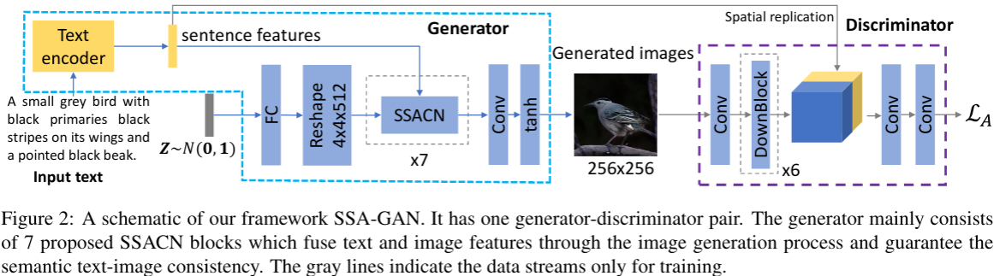

# text2image

This repository includes the implementation for [Text to Image Generation with Semantic-Spatial Aware GAN](https://arxiv.org/abs/2104.00567)

This code is an adaptation of the original implementation with some additions for easy usage. The original code can be found at the following [link](https://github.com/wtliao/text2image).

-----

## Network Structure


The structure of the spatial-semantic aware (SSA) block  is shown as below


-----

## Main Requirements
* Python 3.10.0
* Cuda 11.8+
* Obs: This code was executed only on Windows 10. Must have problems running on another OS.

All requirements can be found on requirements.txt, for easy usage we have a example below to set a virtual environment and run requirements for the implementation.
```
$ python -m venv venv
$ ./venv/Scripts/activate
$ pip install torch==2.0.1 torchvision==0.15.2 torchaudio==2.0.2 --index-url https://download.pytorch.org/whl/cu118
$ pip install -r requirements.txt
```
-----

## Prepare data
Run download_content.py, with the following args below, to download birds dataset:
```
$ python download_content.py --dataset birds --content data
```

You can download the dataset and its metadeta manually following the steps described down below:
1. Download the preprocessed metadata for [birds](https://drive.google.com/open?id=1O_LtUP9sch09QH3s_EBAgLEctBQ5JBSJ) and save them to `data/`
2. Download [birds](http://www.vision.caltech.edu/visipedia/CUB-200-2011.html) dataset and extract the images to `data/birds/`
   1. Alternative [link to birds dataset](https://www.kaggle.com/datasets/xiaojiu1414/cub-200-2011)

### Data structure

```
📦data
  ┣ birds
  ┃ ┣ 📂CUB_200_2011
  ┃ ┣ 📂 test
  ┃ ┣ 📂 text
  ┃ ┗ 📂 train   
```

-----

## Download encoders

Run download_content.py, with the following args below, to download required encoders (To run this line, ensure that this path exists "tmp/bird_sloss01/64/models/"):
```
$ python download_content.py --dataset birds --content encoders
```
You can download the encoders manually following the steps described down below:
1. Download the [pre-trained DAMSM](https://drive.google.com/file/d/1GNUKjVeyWYBJ8hEU-yrfYQpDOkxEyP3V/view?usp=drive_open) for CUB and save it to DAMSMencoders/

-----


## Train model
To train your model from scratch, you will need to run main.py and call the function train. This will automatically happen if you adjust the following configs inside bird.yml as shown below.

1. B_VALIDATION: False -> Set false to train and True to evaluate/generate
2. TRAIN.RESTORE: False -> Set false to train model from scratch
3. TRAIN.BATCH_SIZE: 4 -> default=24, If you run out of memory on your gpu, like in my case, decrease the batch size until a size that you can train the model
4. TRAIN.MAX_EPOCH: 1 -> Number of epochs to train your model
5. TRAIN.NET_G: '' -> Let empty to train model from scratch, if TRAIN.RESTORE = True then put the path of the pretrained model 
6. TRAIN.WARMUP_EPOCHS: 0 -> Number of epochs before starting save the model
7. TRAIN.GSAVE_INTERVAL: 1 -> Interval/number of epochs to save a new model

### Fine tuning
To finetune your model, you will need to run main.py and call the function train. This will automatically happen if you adjust the following configs inside bird.yml as shown below.
1. B_VALIDATION: False
2. RESTORE: True
3. TRAIN.NET_G: ['model_path_fine_tune']
   1. Example: NET_G: 'tmp\bird_sloss01\64\models\netG_590.pth'

### Download pretrained models
Run download_content.py, with the following args below, to download some pretrained models:
```
$ python download_content.py --dataset birds --content models
```
You can find trained models by the authors in they [onedrive repo](https://onedrive.live.com/?authkey=%21AIJQNX5U0px2ah4&id=733DEBC46BC591DD%2147272&cid=733DEBC46BC591DD)

-----

## Generate images
To generate images for your test samples/captions, you will need to run main.py and call the function sampling. This will automatically happen if you adjust the following configs inside bird.yml as shown below.
1. B_VALIDATION: True
2. TRAIN.NET_G: ['model_path']
   1. Example: NET_G: 'tmp\bird_sloss01\64\models\netG_001.pth'

The generated images will be saved in tmp\bird_sloss01\64\models\\[model name]\valid

-----

## Evaluation
The Fréchet Inception Distance (FID) score was calculated using the code available on this repo https://github.com/mseitzer/pytorch-fid

For evaluating the `FID` score run:
```
$ python -m pytorch_fid path/to/dataset1_orig_data path/to/dataset2_generated_data
```
To run the evaluation on GPU, use the flag --device cuda:N, where N is the index of the GPU to use.

Step by step for birds dataset:
1. Run the following command line to create a folder only with the test dataset images
    ```
    $ python load_bird_test_images.py
    ```
2. [Generate some images](#generate-images) using the test set captions (The generated images will be saved in tmp\bird_sloss01\64\models\\[model name]\valid)
3. Replace dataset1_orig_data and dataset2_generated_data in the above command line to calculate fid
   1. dataset1_orig_data = data\birds\test\images (created in step 1)
   2. dataset2_generated_data = tmp\bird_sloss01\64\models\\[model name]\valid
      ```
      $ python -m pytorch_fid data\birds\test\images tmp\bird_sloss01\64\models\[model_name]\valid
      ```

It is also possible to evaluate the diversity score using the script test_lpips.py
```
$ python .\test_lpips.py --orig_image_path [path/to/dataset1_orig_data] 
--generated_image_path [path/to/dataset2_generated_data]
```

### Evaluation result

## Performance
FID score after train model for 1 epoch:


FID score after finetune pretrained model netG_590.pth for 1 epoch:


## Qualitative Results (input/output)
Some qualitative results on birds dataset are shown as follows:

In the left side we have the output of the model training only one epoch
In the right side we have the output of the model training one more epoch after load pretrained model by authors

## Model complexity
The number of trainable parameters is 200

## Reference

If you find this repo helpful in your research, please consider citing our paper:

```
@article{liao2021text,
  title={Text to Image Generation with Semantic-Spatial Aware GAN},
  author={Liao, Wentong and Hu, Kai and Yang, Michael Ying and Rosenhahn, Bodo},
  journal={arXiv preprint arXiv:2104.00567},
  year={2021}
}
```
The code is released for academic research use only. For commercial use, please contact [Wentong Liao](http://www.tnt.uni-hannover.de/en/staff/liao/).

## Acknowledgements

This implementation is an adaptation from the original code in [text2image](https://github.com/wtliao/text2image).

This implementation borrows part of the code from [DF-GAN](https://github.com/tobran/DF-GAN).
